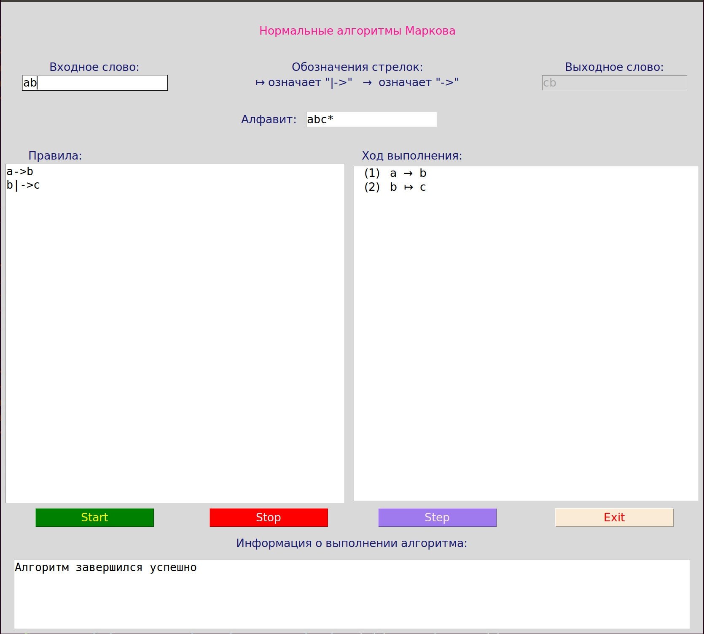

**************************
Инструкция по эксплуатации
**************************

Для полноценной работы данного алгоритма необходимо ввести входные данные для программы: входное слова и правила для его модификации.
Одним из ограничей программы является алфавит. Входный и выходной алфавит фиксированны, равны и состоят из символов  ``a, b, c, *``

Инерфейс имеет вид:

В приведенном примере все поля заполнены корректными данными и показано состояние после корректной работы алгоритма

Ввод входного слова
===================
Входное слово вводится на английском языке без пробелов. Для ввода допустимы только символы входящие в алфавит.
При нажатии символа, не входящего в алфавит, отображение данного символа не происходит. В поле для вывода информации о работе программы отображается произошедшая ошибка и символ, который был некорректно введен.

При вводе пустого слова в диагностическом окне выводится информации об ошибке и предложение для ввода слова и повторного запуска алгоритма.

Ввод правил алгоритма
=====================
При вводе функциональных подстановок необходимо придерживаться определенного формата ввода:

.. note::
	Простая подстановка: L |arrow1| D 

	Терминальная подстановка: L |arrow2| D

.. |arrow1| unicode:: U+2192
.. |arrow2| unicode:: U+21A6

Где для ввода символа |arrow1| используется комбинация ``->``, а для ввода символа |arrow2| используется комбинация ``|->``.
Обратим внимание, что пробелы, табуляция и другие разделители считаются символами. Пустая строка (или заполенная пробелами) между правилами или после них игнорируется.

Информация об ошибках
=====================
* *Ошибка ввода правила:* при вводе в текстовом поле функциональных подстановок, правила не в одном из предложенных выше форматов, будет выведено сообщение об ошибке в поле диагностики о некорректном построении правила. В поле отображения правил будет выведен посимвольно введеный текст с пронумерованными првилами. Чтобы исправить эту ошибку необходимо вставить в правило одну из стрелочек (|arrow1| или |arrow2|).

* *Ошибка ввода символа:* при вводе некорректного символа в текстовое поле для функциональных подстановок, будет выведена ошибка в поле диагностики. Ошибка содержит в себе в каком правиле произшла ошибка, в какой позиции (если считать посимвольно) и какой символ не верен. Ошибочный символ будет напечатан красным цветом в поле для ввода правил. При отображении в список правил, правила нумеруются и печатаюся посимвольно, как при вводе. Для исправления данной ошибки необходимо убрать екорректный символ и повторить запуск программы. При допущении сразу несольких ошибок, будет выделена первая из них.

* *Зацикливание алгоритма:* при вводе правила или комбинации правил, привозящих к зацикливанию алгоритма, выводит информация об ошибке в диагностическое окно. Под зацикливанием понимаем превышение допустимого числа итераций. По дефолту эту значение равно 1000.

****************
Запуск программы
****************
Для корректного запуска программы необходимо корректно заполнить поля ``Входное слово`` и ``Правила``. После этого нажать кнопку **Start**. Если все заполнено корректно, то в поле ``Выходное слово`` будет выведен результат работы алгоритма. В поле для диагностики будет выведено сообщение об успешном завершении работы. В правом окне будут пронумерованы и отображены функциональные подстановки, в которых стрелочки заменены на символы юникода для более понятного отображения.

При некореектном вводе будет получена одна из ошибок, описанных выше.

Для завершения работы программы необходимо нажать кнопку **Exit**.

**************************
Пошаговая работа программы
**************************
Если необходимо пошагово выполнить программу, то после корректного ввода нажимаем кнопку **Step**. В правом окне будут отображены правила, подсвечено фиолетовым цветом правило, которое сейчас выполняется и в поле ``Выходное слово`` будет отображено результирующее значение полсе применения первого шага. Для выполнения следующего шага необходимо повторно нажать кнопку **Step**. Для выхода из пошагового режима необходимо нажать кнопку **Stop**.

При некореектном вводе будет получена одна из ошибок, описанных выше.